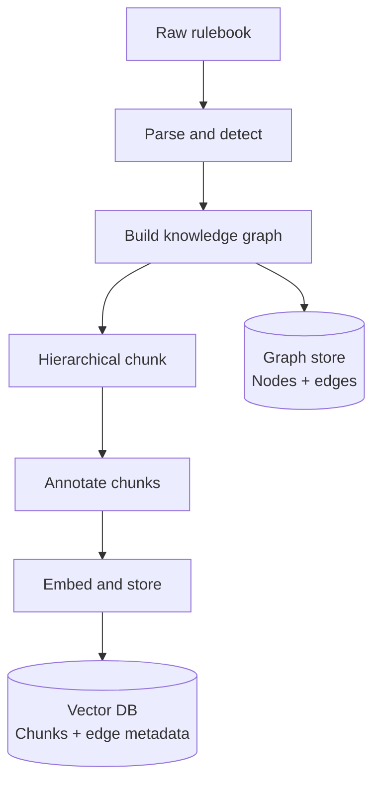
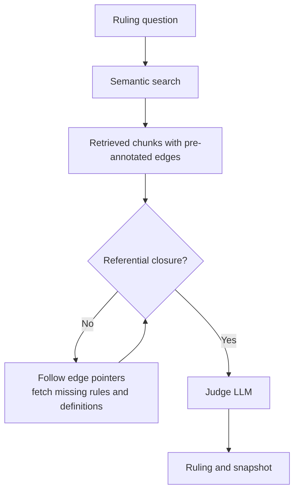
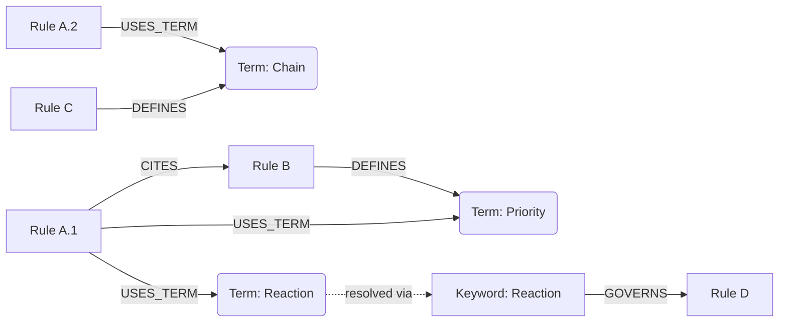

# GRAPH-RAG
## Architecture Decision Document

---

## The Problem

Hierarchical chunking work GREAT for documents like rulebooks because their numerical hierarchicy produces semantically relevant chunks. The biggest problem we face is that those chunks contain pointers to meaning defined elsewhere. A rule about combat procedures might use the term "Spell" — a term defined in a completely separate section. Without that definition, the judge LLM fills the gap with inference, which is a big problem because it WILL hallucinate. 

The knowledge graph solves this by enabling **referential closure** — assembling a context where every term used is defined within that context and every citation points to something already present.

---

## Ingestion Pipeline



### 1. Parse and detect
Ingest the raw rulebook. Detect the numbering scheme automatically from the document structure — no per-game configuration required. Normalize all rule IDs to a canonical form.

### 2. Build the knowledge graph
Process the **entire document** before any chunking. Whole-document context is critical — the annotation pass sees that a term is defined in section X because it has already processed section X. Chunking first would force cross-chunk resolution logic that is both harder to implement and less reliable.

The graph's responsibility is strictly **cross-section relationships** — the connections between rules that hierarchy alone cannot express. Parent-child relationships are not modeled here because they are already captured by the chunk's `section_path` and `parent_id` fields.

**Node types**
- Rule
- Term
- Keyword
- Card

**Edge types**
- `CITES` — explicit cross-references within the document
- `DEFINES` — this rule introduces and defines a term
- `USES_TERM` — this rule uses a term defined elsewhere
- `GOVERNS` — this rule governs the behavior of a keyword

> The specific extraction strategies for building these edges are not prescribed here. Extraction quality will require significant testing and iteration before any approach is committed to.

### 3. Hierarchical chunk
Slice the document following its natural hierarchy. Each chunk inherits its full ancestor path as metadata. Chunking is purely structural at this stage — no edge discovery happens here.

### 4. Annotate chunks
For each chunk, query the pre-built graph: "what edges touch this node?" Attach the results as metadata. The chunk now carries its own pointers to every term and rule it depends on.

```json
{
  "rule_id": "string",
  "text": "string",
  "section_path": ["grandparent", "parent", "this"],
  "parent_id": "string",
  "is_foundational": false,
  "explicit_refs": ["rule_id"],
  "used_terms": [
    { "term": "string", "defined_by": "rule_id", "confidence": 0.0 }
  ],
  "defines": ["term"]
}
```

### 5. Embed and store
Embed chunk text and store with full annotated metadata in the vector database. Edge data lives alongside the vector — one record contains everything needed for context assembly at query time.

---

## Query-Time Flow



### The gap-fill loop

```python
def assemble_context(question, token_budget):
    context = semantic_search(question)
    frontier = context.copy()

    while frontier and token_budget.remaining > threshold:
        missing = (
            get_explicit_refs(frontier) +
            get_used_term_definitions(frontier)
        ) - set(context)

        if not missing:
            break  # referential closure reached

        fetched = fetch_by_id(missing)
        context += fetched
        frontier = fetched  # only expand from new chunks

    return context
```

**Termination** is computable, not a judgment call. The loop exits when the delta is empty — every term and citation in the current context is already present in that context. Token budget is a safety ceiling, not the primary stop condition. Most rulings reach closure in one or two hops.

---

## Knowledge Graph Structure



When a chunk is retrieved by semantic search, the graph immediately surfaces every rule and term it depends on that was not returned by the search. Those dependencies are fetched directly by ID — no second semantic search, no ranking, no noise.

---

## Edge Quality

Only edges that can be derived from explicit document content are stored in the graph. Implicit conceptual dependencies — rules that are related by game logic but share no explicit citation or defined term — are deliberately excluded. Storing implicit edges introduces noise that could degrade ruling quality, and the confidence required to act on an edge in a ruling context is higher than any automated implicit extraction can reliably provide.

| Edge type | Source | Confidence |
|---|---|---|
| `CITES` | Explicit citations in document text | ~95% |
| `GOVERNS` | Keyword glossary sections | ~92% |
| `DEFINES` | Definitional language in document text | ~85% |
| `USES_TERM` | Term index matching | ~75% |

---

## Architectural Decision Summary

### 1. The graph solves the reference problem structurally
The knowledge graph enables referential closure — a precise, computable property. This is the correct goal because it is not fuzzy. If the graph is complete, gap-filling is guaranteed. The system degrades gracefully on incomplete edges rather than failing silently, because missing edges mean the judge LLM receives slightly less context, not wrong context.

### 2. The quality bar is humans, not perfection
The graph only captures what is explicitly stated in the document. Implicit rule interactions — dependencies that exist by game logic but are never written down — are not modeled. This is an intentional constraint, not a gap. Humans miss implicit interactions constantly, which is precisely why errata and FAQs exist in every serious TCG. The graph matches the reliability of what is formally documented, which is the same information a human judge is expected to work from.

### 3. Implicit gaps are self-correcting through the corrections pipeline
When an implicit dependency causes a ruling dispute, it gets formalized. Errata, FAQs, and clarifications are first-class versioned documents in the lifecycle spec. When they are ingested, they create new explicit edges in the graph. The category where the graph has no coverage today is the same category that gets continuously patched by the game's own rules maintenance process — without any additional engineering on this system.
